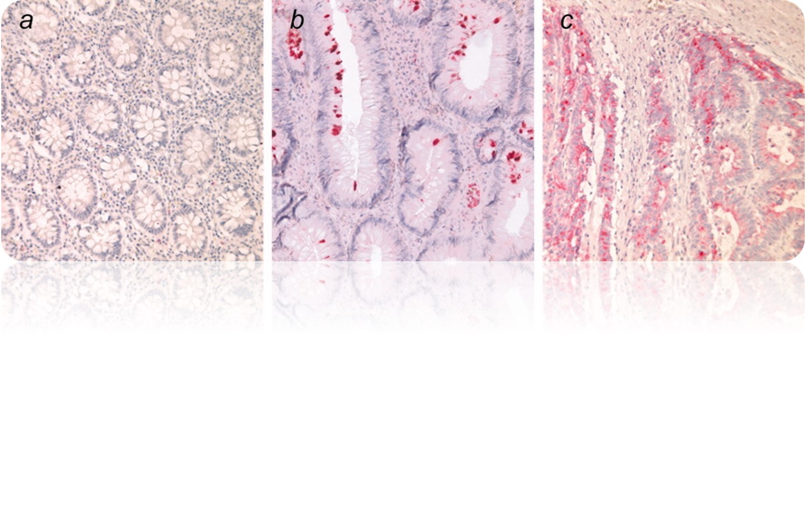

# Predicting-Pancreatic-Cancer-using-Urinary-Biomarkers

## Table of Contents

1) [Background](#background)
2) [Goals](#goals)
3) [Process](#process)
4) [Data](#data)
5) [Results](#results)
6) [Deployed Model](#deployment)
7) [Future Considerations & Challenges](#future_considerations)
8) [References](#references)
9) [Github Files Directory](#github_files)

## Background

According to the World Cancer Research Fund International, pancreatic cancer constitutes ~2.7% of global cancer cases and affects almost 500,000 individuals annually. In its early stages, pancreatic cancer often presents with no noticeble symptoms, and when symptoms do arise, they mimic other general gastrointestinal conditions leading to misdiagnosis or delayed diagnosis. Additionally, there is a lack of effective screening tests compounded by the diseases tendancy for rapid progression and the pancreas's deep abdominal location. Early detection, associated with higher likelihoods of survival in other cancers, is difficult for pancreatic cancer. Consequently, pancreatic cancer disproportionately accounts for ~8% of the global cancer related deaths.

Several pancreatic screening methods exist, include imaging test like MRI and CT scans, endoscopic ultrasound, blood tests and endoscopicretrograde cholangiopancreatography (ERCP), which involves injecting dye into the pancreatic and bile ducts for X-rays. However, none of these tests are conclusive alone and are all invasive and costly. A promising [study](https://journals.plos.org/plosmedicine/article?id=10.1371/journal.pmed.1003489) published in 2020 by Debernardi S. et al., titled "A combination of urinary biomarker panel and PancRISK score for earlier detection of pancreatic cancer: A case–control study." offers a preliminary conclusion that biomarkers found in a common urine sample may hold the key to early pancreatic cancer detection. Within this study there are 3 groups of participants, healthy individuals (a), individuals with benign tumors (b) but not life threatening and individuals that have malignant tumors at varing stages of cancer (c). 

"C:\Users\ellis\Lighthouse Labs\Lighthouse Tests +Projects\Predicting-Pancreatic-Cancer-using-Urinary-Biomarkers\images\pancreatic carcinoma.jpg"

## Goals
Using the [dataset](https://www.kaggle.com/datasets/johnjdavisiv/urinary-biomarkers-for-pancreatic-cancer) "Urinary biomarkers for pancreatic cancer" from Kaggle, this project aims to develop a supervised machine learning model capable of predicting the presence of malignant cancer in a patient based on their urinary biomarker levels, gender and age. The primary objective is to create a reliable and non-invasive method for early detection of pancreatic cancer, ultimately enhancing patient outcomes on a global scale. By integrating this model into a professional healthcare setting, it could serve as a valuable tool for assisting healthcare professionals in diagnosing pancreatic cancer earlier, more accurately and efficiently. This project seeks to complement existing diagnostic techniques, potentially improving the overall accuracy of pancreatic cancer screening. 

## Process

**1) Data Collection:** Research and gathering data. 
**2) EDA:** Cleaning and visualization. 
**3) Data Preprocessing:** Handling data to get ready for modeling. 
**4) Feature Selection:** Choosing subsets of the data for modeling. 
**5) Modelling:** Selecting the best supervised classification model for evaluation. 
**6) Hyperparameter Tuning:** Iteratively tuning parameters and 'EDA' steps to obtain best results. 
**7) Reporting:** Summarizing finding using various methods. 
**8) Deployment:** Deployment of current model onto AWS

## Data 

Due to the sensitive nature of this data, there was no other publicly available data. However, supporting datasets were found and can be located from the [references](#references) section. The original data columns are listed below with the following descriptions:

* sample_id: Unique string identifying each subject
* patient_cohort: Cohort 1,  previously used samples; Cohort 2, newly added samples
* sample_origin: origin of sampling project - BPTB: Barts Pancreas Tissue Bank, London, UK; ESP: Spanish National Cancer Research Centre, Madrid, Spain; LIV: Liverpool University, UK; UCL: University College London, UK
* age: Age in years
* sex: M = male, F = female
* diagnosis: 1 = control (no pancreatic disease), 2 = benign hepatobiliary disease (119 of which are chronic pancreatitis); 3 = Pancreatic ductal adenocarcinoma, i.e. pancreatic cancer
* stage: For those with pancratic cancer, what stage was it? One of IA, IB, IIA, IIIB, III, IV
* benign_sample: For those with a benign, non-cancerous diagnosis, what was the diagnosis?
* plasma_CA19_9: Blood plasma levels of CA 19–9 monoclonal antibody that is often elevated in patients with pancreatic cancer. Only assessed in 350 patients (one goal of the study was to compare various CA 19-9 cutpoints from a blood sample to the model developed using urinary samples).
* creatinine: Urinary biomarker of kidney function
* LYVE1: Urinary levels of Lymphatic vessel endothelial hyaluronan receptor 1, a protein that may play a role in tumor metastasis
* REG1B: Urinary levels of a protein that may be associated with pancreas regeneration.
* TFF1: Urinary levels of Trefoil Factor 1, which may be related to regeneration and repair of the urinary tract
* REG1A: Urinary levels of a protein that may be associated with pancreas regeneration. Only assessed in 306 patients (one goal of the study was to assess REG1B vs REG1A)

Data handling:

1) 'Sex' was encoded to numerical 'is male' column
2) Various missing value handling methods were implemented and compared:
    * Column removal
    * Mean replacement
    * KNN replacement
    * Logisitc Regression Model
3) Various scaling and normalization techniques were implemented and compared:
    * Min Max Scaler
    * Robust Scaler
    * Quantile Transformation
    * Log Transformation
4) Various feature selection techniques were implemented and compared:
    * Recursive Feature Elimination
    * Lasso Regression
    * Principle Component Analysis (PCA)

## Results

After a process of iterating through data processing steps and hyperparameters, the best model had the following parameters:
* Missing Value Imputer: Mean
* Scaling / Normalization: Robust Scaling
* Feature Selection: Recursive Feature Elimination
* Data Splitting: Train Test Split
* Classification Model: Gradient Boosting Classification
   * Learning Rate: 0.18
   * Loss: exponential
   * Max_depth: 3
   * Max_features: None
   * Min_samples_lead: 1
   * Min_samples_split: 2
   * N_estimators: 50
   * Subsample: 0.9

This allowed for the model to have the following results:
* Accuracy: 94.1%
* Predicting 0 (no cancer)
   * Precision: 0.95
   * Recall: 0.96
   * F1 - score: 0.96
* Predicting 1 (cancer)
   * Precision: 0.92
   * Recall: 0.89
   * F1 - score: 0.91
 
This model was chosen because of the ability to strike a balance between minimizing FALSE POSITVE RATES and FALSE NEGATIVE RATES. While it is essential that both types of errors should ideally be reduced, the FALSE POSTIVE RATE is a much higher concern, outweighing that of the FALSE NEGATIVE RATE.  
FALSE POSITIVES: Since there is proportionately much more individuals who fall in the ACTUAL NEGATIVE category, the number of overdiagnosis cases are significantly higher than the misdiagnosis cases. Overdiagnosis, can lead to significant consequences, including unnecessary treatment (medical resource strain included), and pychosomatic symptoms arising from the placebo effect in otherwise healthy individuals.  
FALSE NEGATIVES: Conversely, for  individuals facing misdiagnosis, a complex decision concerning ethics is involved, as it hinges on the risk of missed diagnoses and delayed treatment for those who need it. Fortunately, the occurance of FALSE NEGATIVES represent a much smaller percentage of the entire population compared to the FALSE POSITIVES group.

## Deployed Model

## Future Considerations & Challenges

As a basic functional supervised learning model, this initial project serves to demonstrate an understanding of the potential benefits that such a supervised model could offer - particularly in healthcare and aiding in diagnosing rare diseases. However, it is essential to address the limitations that this project faces - primarily concerning the use of a relatively small dataset with a large portion of missing data (ie. plasma_CA19_9 and REG1A data). To develop a more robust and reliable model, more data would be needed. Establishing partnerships with current large-scale observational studies such as [UroPanc](https://www.pcrf.org.uk/pancreatic-cancer-research/pancreatic-cancer-research-fund-tissue-bank/), could provide access to more comprehensive datasets enabling better model training. 

Additional feature engineering or hyperparameter tuning may enhance the model's ability to identify positive cancer cases accurately.  In real-world scenarios, the incidence of positive pancreatic cancer diagnoses is typically lower than negative diagnoses, leading to an imbalance in true values that presents a significant challenge. To address this challenge, employing techniques such as resampling methods or adjusting class weights can help mitigate the impact of class imbalance and enhance the model's effectiveness in detecting positive cases.

Implementation of this model into real-world healthcare systems presents a complex challenge, particularly concerning its scope of use as a preliminary, non-invasive screening process followed by more intensive invasive procedures. Ethical considerations must be addressed, ranging from patient privacy and consent, to the potential for misdiagnosis or overdiagnosis - ultimately leading to patient outcomes. Additionally, issues related to algorithm bias and equitable access to healthcare must be carefully addressed to ensure the model's ethical use and effectiveness in clinical practice.

At present, the model is deployed on AWS, providing accessibility and scalability for further development and deployment. Looking ahead, there are several ways to enhance this project. These include refining the model's architecture, incorporating additional data sources, and implementing advanced algorithms to improve its predictive capabilities. These advancements may also extend to mobile applications by using frameworks such as TensorFlow Lite, enpowering individuals to gain insight about their own health outcomes. By continuing to refine and iterate upon this prototype, more impactful applications of supervised learning in healthcare may emerge.

## References

Christian Astosini, Claudia Roeefzaad, Yi-Yang Dai, Brian K. Dieckgraefe, Thomas Jons, Wolfgang Kemmner, (2008) REG1A expression is a prognositic marker in colorectal cancer and associated with peritoneal carcinomatosis. International Journal of Cancer. https://doi.org/10.1002/ijc.23466  

Debernardi S, O’Brien H, Algahmdi AS, Malats N, Stewart GD, et al. (2020) A combination of urinary biomarker panel and PancRISK score for earlier detection of pancreatic cancer: A case–control study. PLOS Medicine 17(12): e1003489. https://doi.org/10.1371/journal.pmed.1003489  

John, D., & Debernardi, S. (Jan. 2023). Urinary biomarkers for pancreatic cancer. https://www.kaggle.com/datasets/johnjdavisiv/urinary-biomarkers-for-pancreatic-cancer/data  

Survival Rates for Pancreatic Cancer. American Cancer Society. (2024, January). https://www.cancer.org/cancer/types/pancreatic-cancer/detection-diagnosis-staging/survival-rates.html  

Worldwide cancer data: World cancer research fund international. WCRF International. (2022, April). https://www.wcrf.org/cancer-trends/worldwide-cancer-data/#:~:text=Breast%20and%20lung%20cancers%20were,contributing%2010.7%25%20of%20new%20cases  

## GitHub File Directory

- Project Folder
    - data
        -  raw_data (original data file from Kaggle)
        -  data documentation (original data documentation from Kaggle)
    - images
        - various images (descriptions available in images_README.md)
    - notebooks
        - EDA.ipynb (preliminary exploration of data)
        - trials.ipynb (various trials of iterating data preprocessing steps and hyperparameter tuning for optimal results)
        - final_results.ipynb (reported results with conclusions)
        - **testing.ipynb (formatted notebook with instructions on how to test and modify parameters)**
    - scripts
        - data_preprocessing.py (missing data handling / scaling + normalization / feature selection / data train test split)
        - evaluation.py (accuracy / classification model / ROC curve)
        - model_training.py (several classification models ready for trial)
        - open_file.py (inital script for opening file and light preprocessing)
